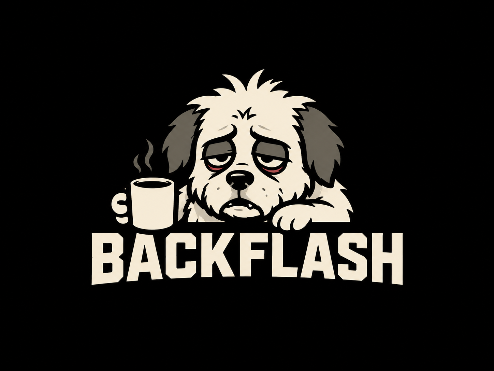

# BACKFLASH

[](https://github.com/Is0cre/flashback-analyzer/actions/workflows/ci.yml)



BACKFLASH är en fristående terminalklient för nattpasset: en läsare och
analysvy för Flashback, en karta över Polisens publika händelseflöde med
närhetslarm, ett frivilligt P2P-cachenät över Yggdrasil, och en inbyggd
end-to-end-krypterad chatt inspirerad av gammal IRC. Allt körs lokalt, allt
är tangentbordsstyrt, och ingenting postar tillbaka till Flashback.

ASCII-logotypen och den bakfulla terminalhunden är egna identitetselement;
BACKFLASH är inte en officiell Flashback-klient.

## Vad BACKFLASH gör

- **Forum** — bläddrar och cachar Flashbacks forumträd och trådar lokalt i
  SQLite, med full FTS5-sökning offline. Read-only: verktyget postar,
  loggar in och kringgår aldrig CAPTCHA/ålderskontroll.
- **Polishändelser** — hämtar Polisens publika händelse-API, ritar dem som
  en färgkodad karta över Sverige direkt i terminalen (halvblockstecken,
  ingen bild/Sixel behövs) sida vid sida med händelselistan, och kan larma
  (terminalpip + bannerprompt) när en ny händelse dyker upp nära din egen
  plats — se [Närhetslarm](#närhetslarm) nedan.
- **Cache-mesh** — en frivillig, publik cache av redan hämtat
  Flashback-innehåll delad över ett inbäddat Yggdrasil-nät. Avstängd som
  standard; se [docs/mesh-runtime.md](docs/mesh-runtime.md).
- **BACKFLASH E2E-CHATT** — en IRC-inspirerad gruppchatt byggd på
  [Gandr](src/gandr/README.md), ett fristående federerat protokoll: Ed25519-
  identitet i stället för konto, petnamn i stället för användarnamn, inga
  serverloggar av vem som pratar med vem, och all trafik dubbelkrypterad
  över Yggdrasil. Se [Chatten](#backflash-e2e-chatt) nedan.

## Installation

```bash
go build -o backflash ./cmd/backflash
./backflash version
```

eller kör direkt utan att bygga en binär:

```bash
go run ./cmd/backflash
```

### Windows

För en färdig Windows 64-bitarsbinär, öppna PowerShell i katalogen där
`backflash-windows-amd64.exe` och installationsskriptet ligger:

```powershell
Set-ExecutionPolicy -Scope Process Bypass
.\deploy\install-backflash-windows.ps1 -Binary .\backflash-windows-amd64.exe
```

Skriptet skapar lokal konfiguration och frågar separat om TCP-port 4242 ska
öppnas för den frivilliga publika cache-meshen. Vanlig lokal läsning kräver
ingen brandväggsregel och mesh är avstängt som standard. Fullständig
Windows-installation finns i [docs/install-windows.md](docs/install-windows.md).

## Snabbstart

`backflash` (eller `go run ./cmd/backflash`) öppnar direkt i det lokala
NOC-dashboardet. Ingen nätverksanslutning krävs för att läsa redan lagrat
innehåll.

Tangentbord (globalt, oavsett vy):

| Tangent | Vy |
| --- | --- |
| `h` | Översikt / dashboard |
| `f` | Forum |
| `/` | Fjärrsök på Flashback |
| `p` | Polishändelser + karta |
| `m` | Cache-mesh |
| `g` | BACKFLASH E2E-CHATT |
| `ctrl+p` / `?` | Kommandopalett |
| `q` / `ctrl+c` | Tillbaka / avsluta |

`j`/`k` eller piltangenterna flyttar markören i listor; `Enter` öppnar det
markerade objektet. Musen fungerar också (klick + scroll) där terminalen
stödjer det.

## Polishändelser & närhetslarm

`p` öppnar kartan: Polisens senaste händelser ritas som färgkodade punkter
över en handritad Sverigesilhuett, med händelselistan bredvid på breda
terminaler. Markera en rad i listan för att se dess punkt lysa upp på
kartan.

### Närhetslarm

Larmet är helt opt-in och avstängt som standard. Sätt en radie i kilometer
för att slå på det:

```bash
BACKFLASH_ALERT_RADIUS_KM=10 backflash
```

Vid start slår BACKFLASH då upp en ungefärlig plats via en gratis
IP-geolokaliseringstjänst (endast din publika IP lämnar maskinen — inga
konton, inga nycklar) och pollar sedan Polisens flöde i bakgrunden oavsett
vilken vy du står i. En ny händelse inom radien ringer terminalens
pip-signal och visar en röd larmbanner tills den kvitteras med `a`.
`BACKFLASH_MUTE=1` stänger av alla ljud (larm och notiser) utan att stänga
av larmlogiken i sig.

## BACKFLASH E2E-CHATT

Chatten är BACKFLASH:s UI mot [Gandr](src/gandr/README.md) — en fristående,
federerad protokollimplementation som lever i det här repot
(`src/gandr` för protokoll/daemon, `internal/gandr` för BACKFLASH:s
klientlager). Det är inte "krypterad Discord": det finns ingen server som
äger din identitet.

- **Identitet = nyckel, inte konto.** Ed25519-nyckelpar, inga lösenord
  skickas någonstans, inga e-postadresser.
- **Petnamn, inte användarnamn.** Namn du sätter på andras nycklar lever
  bara i din egen krypterade lokala databas — de skickas aldrig över
  nätet och syns aldrig för någon annan.
- **Dubbel kryptering.** Yggdrasil-transporten är krypterad i sig; Gandr
  lägger på en egen signerad, krypterad sessionsnivå ovanpå. Noden som
  routar trafiken kan inte läsa den.
- **Inga metadata-loggar.** Ingen logg över vem som pratade med vem, inga
  analytics, ingen telemetri. En beslagtagen nod ger ingenting användbart.
- **Routat över Yggdrasil**, inbäddat direkt i klienten — inget separat
  VPN, ingen TUN, inget root-krav.

Starta med `g` i BACKFLASH. Första gången skapas ett lokalt valv (lösenord
krypterar din identitetsnyckel på disk); `gandrd` behöver köra separat som
daemon för att faktiskt nå andra noder — se
[src/gandr/README.md](src/gandr/README.md) för protokolldetaljer och
[src/gandr/docs/SETUP.md](src/gandr/docs/SETUP.md) för att sätta upp en
daemon.

### Peering

Gandr har inget centralt failover eller katalogserver — bara noder som
väljer att peera med varandra, precis som gammal IRC-federation. En "seed"
är bara en välkänd första kontakt, inte en auktoritet: en `gandrd`-daemon
körd på backflash-cache-servern med enda uppgift att hjälpa nya klienter
hitta sin första peer över Yggdrasil. Den ser aldrig meddelandeinnehåll
och lagrar inget som går att koppla till en identitet om den beslagtas —
en kurir, inte en värd, precis som vilken annan nod som helst.

BACKFLASH ansluter automatiskt till den publika seeden första gången
chatten startas, så en ny användare aldrig behöver veta vad en
Yggdrasil-nyckel ens är. Nyckeln bakas in i klienten
(`defaultSeedYggdrasilKey` i `internal/tui/app.go`) — sätt
`BACKFLASH_SEED_KEY=<64 hex>` för att peka på en egen seed i stället, eller
`BACKFLASH_SEED_KEY=-` för att stänga av auto-anslutningen helt.

`gandrd` (seed-daemonen) byggs numera av samma release-pipeline som
`backflash`/`backflash-cache` — inget behöver byggas på servern. Se
[docs/gandrd-seed-debian.md](docs/gandrd-seed-debian.md) för
enradsinstallation från en GitHub Release.

## Cache-mesh

En frivillig, publik cache av redan hämtat Flashback-innehåll, delad mellan
BACKFLASH-noder över ett inbäddat Yggdrasil-nät — avstängd som standard,
egen identitet helt separerad från Gandr/chatten. Se
[docs/mesh-runtime.md](docs/mesh-runtime.md) för identitet, konfiguration
och drift, och [docs/cache-node-debian.md](docs/cache-node-debian.md) för
att sätta upp en publik cache-peer.

## Datamodell

```text
threads ──< posts >── users
             │
             ├──< quotes
             ├──< links
             └──< stances >── questions
```

`raw_pages` bevarar hämtad HTML med hash och källa. `posts.content_hash` och
`posts.source_url` gör varje normaliserat inlägg spårbart. `schema_version`
och additiva migreringar gör att äldre SQLite-filer kan öppnas utan att data
skrivs om eller förloras.

Citaten ligger separat. `posts.text` försöker endast innehålla vad
skribenten själv skrev, medan `posts.raw_text` behåller hela det renderade
meddelandet för felsökning.

## Nästa steg: opinion

Nästa lager bör inte vara vanlig sentimentanalys. Flödet bör vara:

```text
tråd
  → upptäck huvudfrågor/teser
  → klassificera varje relevant post per fråga
  → aggreggera per unik användare
  → aggreggera separat per inlägg
  → argumentkluster
  → opinion över tid
```

Föreslagna stance-värden finns redan i SQLite-schemat:

```text
strong_yes
probably_yes
uncertain
probably_no
strong_no
irrelevant
unclear
```

Det gör att en extremt aktiv användare aldrig automatiskt blir "100 röster".

## Viktigt om parsern

Flashbacks HTML kan ändras. Parsern använder därför flera fallbacks. Lägg en
anonymiserad HTML-fixture i `tests/fixtures/` när du hittar en struktur
parsern missar.

## Utveckling

```bash
go test ./...
go vet ./...
CGO_ENABLED=0 go build ./...
```

Samma tre steg körs i CI (`.github/workflows/ci.yml`) på varje push och PR
mot `main`. Releaser byggs från git-taggar av formatet `v*` — se
[docs/releases.md](docs/releases.md).
